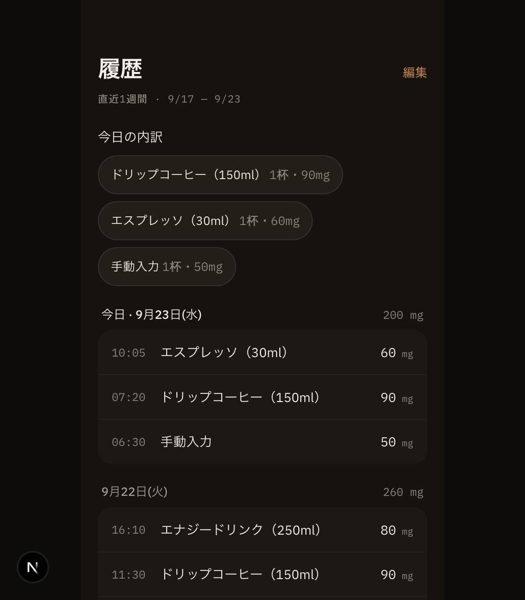
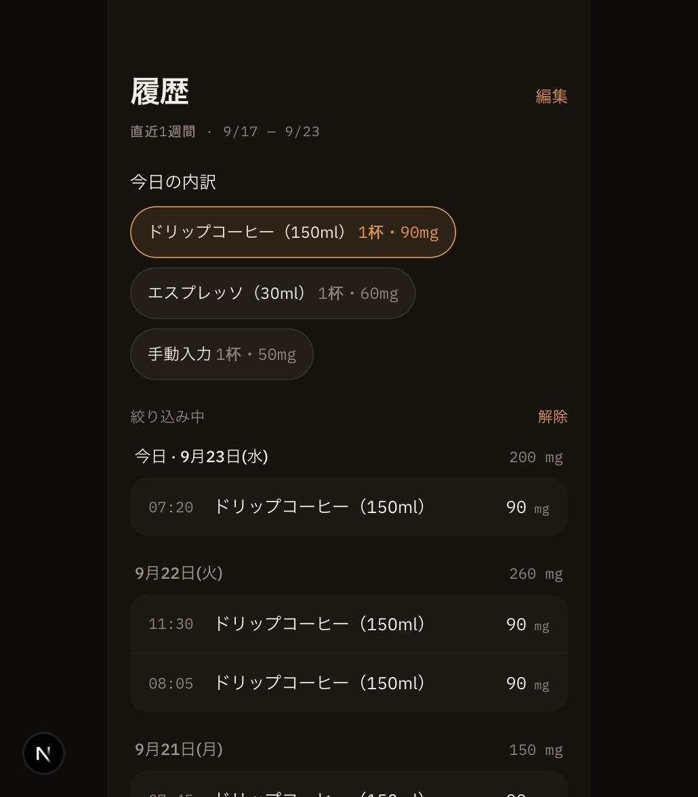
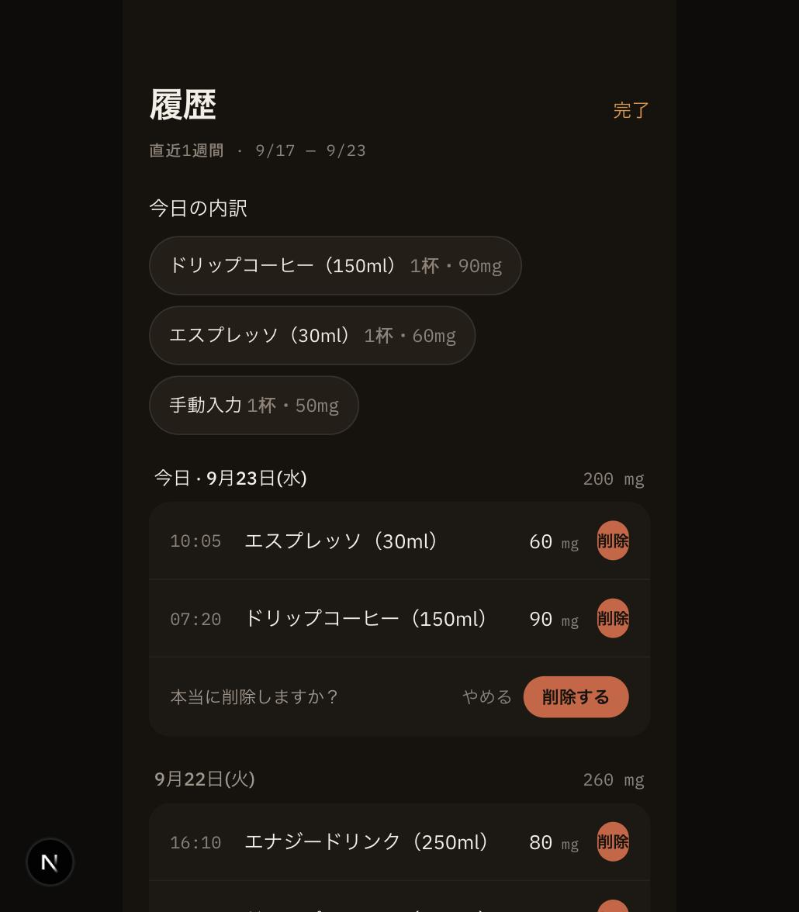

# 履歴画面（3-4）の画面エビデンス

- 撮影日: 2026-09-23
- 対象実装: `components/HistoryList.tsx` / `app/history/page.tsx`（フェーズ3-4 履歴）
- 環境: Chrome、402 × 950px、`npm run dev`（Turbopack）
- データ: 検証専用の架空記録（当日〜8日前を含む10件、範囲外・未来分を含む）。通常利用の保存データは使用していない。

1. 履歴一覧を開き、直近1週間（9/17〜9/23）が日付ごとにグルーピングされ、今日の飲み物別内訳（ドリップコーヒー・エスプレッソ・手動入力）が表示されることを確認。
2. 「ドリップコーヒー」の内訳をタップし、複数日（今日・9/22・9/21…）にまたがって該当行だけに絞り込まれ、日次合計はフィルター前の実数値のまま保たれることを確認。「解除」で全件表示に戻ることも確認。
3. 「編集」で削除モードに入り、行の「削除」ボタンから「本当に削除しますか？／やめる／削除する」の確認ステップが挟まることを確認。「やめる」でキャンセルした場合は削除されないことも別途確認済み（PR本文・TODO.md参照）。

| 履歴一覧・今日の内訳 | 内訳タップでの絞り込み | 削除の確認ステップ |
|---|---|---|
|  |  |  |

画像は表示状態の証跡。8日前の記録が表示範囲外として除外されること、未来時刻の記録が除外されること、削除実行後のlocalStorageへの反映、読み込み失敗時のエラーバナー、空状態などの検証結果はPR本文とTODO.mdを参照。
