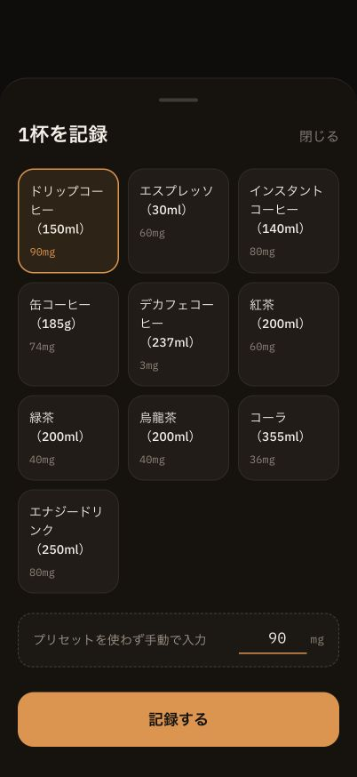
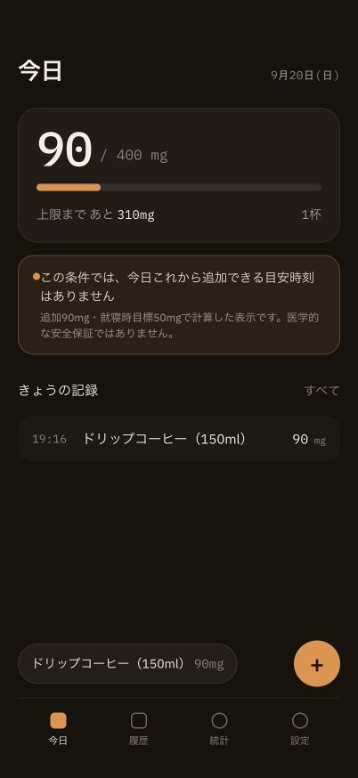

# ホームFAB接続の画面エビデンス

- 撮影日: 2026-09-20
- 対象実装: `aecf735`（ホームFABからIntakeFormへの接続）
- 環境: Chrome、402 × 874px、Turbopack本番ビルドを専用ポート3119で起動
- データ: 検証専用の架空記録。通常利用の保存データは使用していない。

1. ホームの「記録を追加」から開き、ドリップコーヒー90mgを選択。保存ボタンが有効になることを確認。
2. 「記録する」を1回押し、シートが閉じ、ホームに90mg・1杯・記録行・クイック追加候補が反映されることを確認。
3. 撮影時のブラウザコンソールにエラー・警告なし。

| フォームでプリセットを選択 | 保存後のホーム |
|---|---|
|  |  |

画像は表示状態の証跡。保存失敗時の入力保持、キーボード操作、375px・1280pxなどの検証結果はPR本文とTODO.mdを参照。
