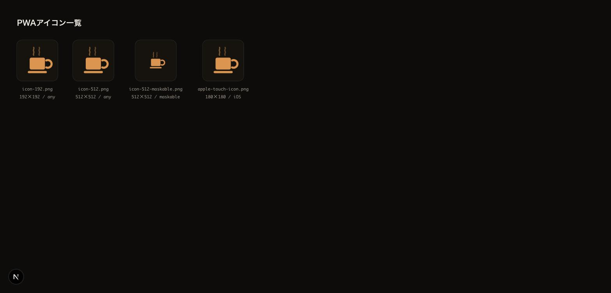
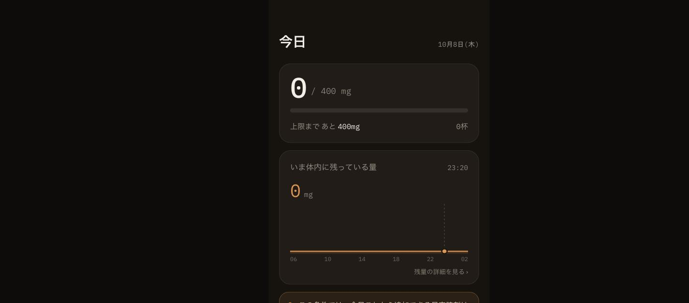

# PWA対応（フェーズ5）の画面エビデンス

- 撮影日: 2026-10-08
- 対象実装: `public/manifest.json` / `public/sw.js` / `public/icons/` / `components/ServiceWorkerRegistration.tsx` / `app/layout.tsx`
- 環境: Chrome、`npm run build && npm run start`（本番ビルド）

1. 4種類のPWAアイコン（192×192 any、512×512 any、512×512 maskable、180×180 Apple touch icon）が正しく生成・配信されていることを確認。
2. 通常のオンライン起動時のホーム画面。Service Workerが`activated`・`navigator.serviceWorker.controller`設定済みであることをコンソールで確認済み（画像外）。
3. `next start`サーバーを実際に停止（ポートを完全に閉じてネットワーク到達不能にした状態）してリロードし、エラー画面ではなくホーム画面がそのまま表示されることを確認。手書きService Workerの「読み込んだものをその場でキャッシュする」方式が機能していることの証跡。

| PWAアイコン一覧 | 通常起動（オンライン） | サーバー停止後の再読み込み（オフライン相当） |
|---|---|---|
|  |  |  |

画像は表示状態の証跡。manifest.jsonの内容・`<head>`内の各種meta/linkタグ（`theme-color`・`apple-touch-icon`・`mobile-web-app-capable`等）・未キャッシュルートへの直接アクセス時のフォールバック挙動の検証結果はPR本文を参照。
