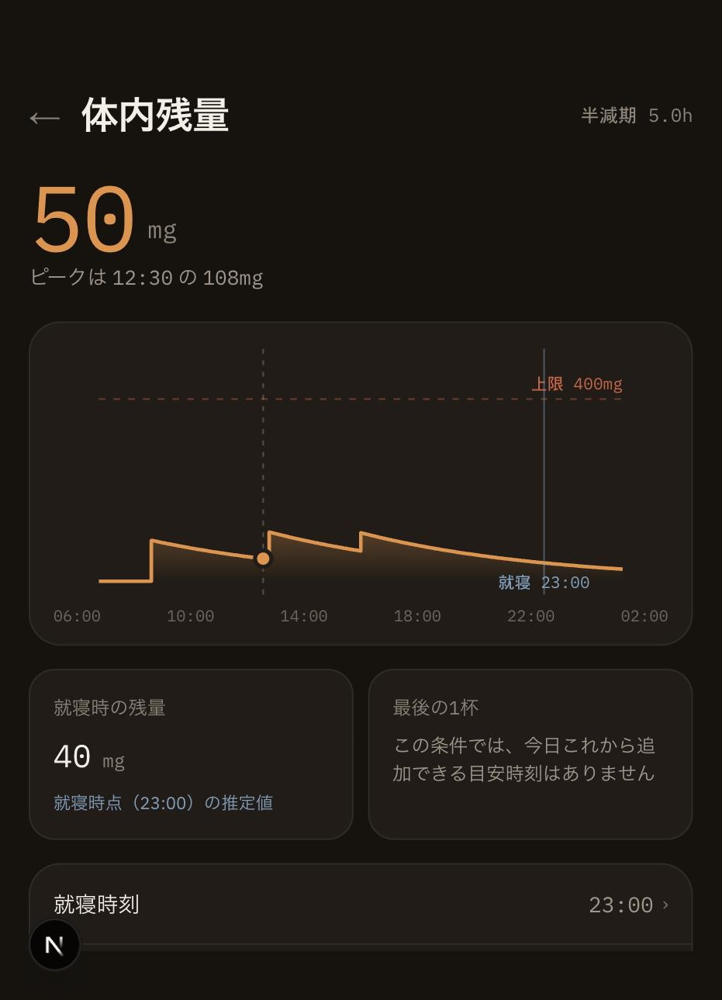
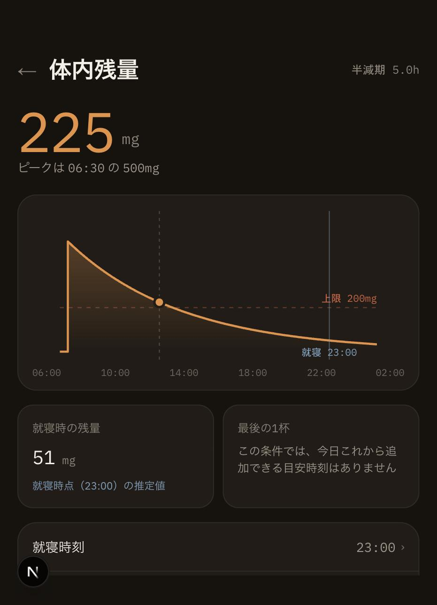
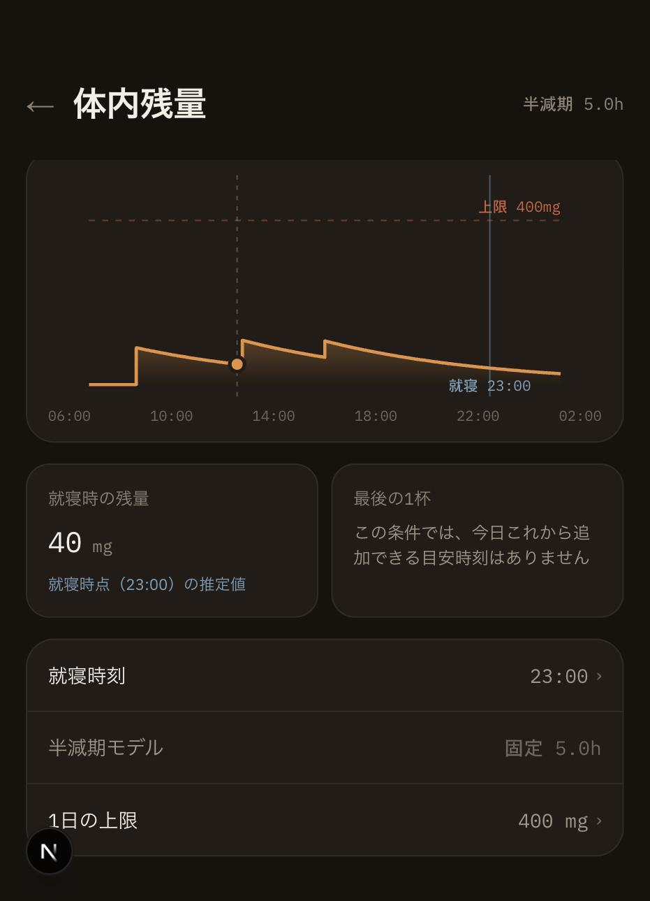

# 体内残量詳細（3-3）の画面エビデンス

- 撮影日: 2026-09-26
- 対象実装: `components/ResidualCard.tsx`（フェーズ3-3 体内残量詳細）
- 環境: Chrome、402 × 950px、`npm run dev`
- データ: 検証専用の架空記録。通常利用の保存データは使用していない。

1. 通常データ（3杯・1日の上限400mg）で開き、大数値・ピーク時刻/量・減衰カーブ（上限ライン・現在位置・就寝ライン）・就寝時の残量・最後の1杯・設定リストが表示されることを確認。
2. 極端な例（500mgを一度に記録・1日の上限200mg）で、ピークに合わせてグラフの縦軸が自動スケーリングされ、上限ライン（200mg）をカーブが上回る様子が正しく描画されることを確認。上限ラインの意味はチームでA案（`settings.dailyLimitMg`を残存量の縦軸にそのまま重ねる）に決定済み。
3. 設定リストの「就寝時刻」「1日の上限」に`›`が付き、`/settings`への遷移導線になっていること、「半減期モデル」は静止表示のままであることを確認。

| 通常データでの表示 | ピークが上限を超えるケース | 設定リスト |
|---|---|---|
|  |  |  |

画像は表示状態の証跡。戻るボタン・Escでのクローズ、読み込み失敗時のエラーバナー、記録0件時の表示、375px/1280pxでの検証結果はPR本文とTODO.mdを参照。
